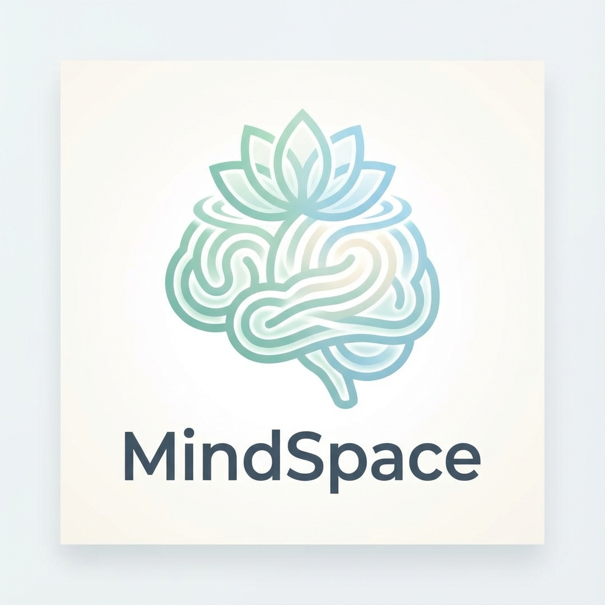

<div align="center">
  
  <h1>MindSpace</h1>
  <h3>Your AI-Powered Mental Health Companion</h3>
  <p>
    <b>Compassionate • Intelligent • Private</b>
  </p>

  <p>
    <a href="https://nextjs.org"></a>
    <a href="https://typescriptlang.org"></a>
    <a href="https://tailwindcss.com"></a>
    <a href="https://openai.com"></a>
  </p>
</div>

<br />

<div align="center">
  
</div>

<br />

## 🌟 Overview

**MindSpace** represents the next evolution in digital mental wellness. By bridging the gap between advanced generative AI and psychological principles, MindSpace offers a **judgment-free, 24/7 sanctuary** for your thoughts.

It's not just a chatbot; it's a **virtual psychologist** engineered with specific persona constraints to listen, validate, and guide you through stress, anxiety, or low motivation using evidence-based cognitive frameworks.

---

## ✨ Why MindSpace?

### 🧠 Deeply Empathetic AI
Unlike generic assistants, MindSpace is fine-tuned to mirror the active listening skills of a therapist. It reformulates your feelings to ensure you feel heard before helping you explore solutions.

### 📊 Real-Time Emotional Intelligence
As you type, our advanced sentiment analysis engine decodes detailed emotional states—tracking **Joy, Anxiety, Stress, and Motivation** in real-time. Watch your emotional journey unfold on beautiful, dynamic charts.

### 🛡️ Privacy-First Architecture
Your mental health is personal. MindSpace is built with a **confidentiality-first** mindset. We also offer a **Local Fallback Mode**, ensuring the app remains functional and private even without internet connectivity.

### ⚡ Hybrid AI Engine
Leverage the best of both worlds:
*   **OpenAI GPT-4:** For deep, nuanced, and complex reasoning.
*   **Groq Llama 3:** For lightning-fast, near-instant supportive responses.

---

## 🚀 Quick Start

### Prerequisites
*   Node.js 18+

### Setup

```bash
# 1. Clone the repository
git clone https://github.com/sanadzhioua/MindSpace.git
cd MindSpace

# 2. Install dependencies
npm install

# 3. Configure API Keys (.env.local)
# OPENAI_API_KEY=sk-...
# GROQ_API_KEY=gsk-...

# 4. Launch
npm run dev
```

Visit `http://localhost:3000` to begin your journey.

---

## 🤝 Contributing

We believe in open-source mental health innovation.
1.  Fork the repo
2.  Create your feature branch
3.  Submit a Pull Request

## 📄 License
MIT License. Built with ❤️ for better mental health.
