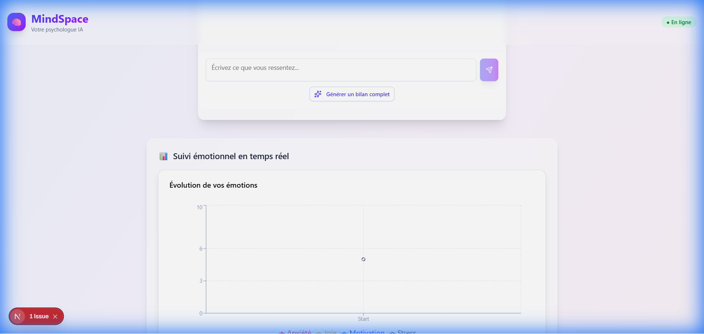

# 🧠 MindSpace - AI Mental Health Coach



> **A compassionate, AI-powered virtual psychologist designed to provide immediate emotional support and personalized mental health guidance.**

[](https://nextjs.org/)
[](https://www.typescriptlang.org/)
[](https://tailwindcss.com/)
[](https://openai.com/)
[](https://groq.com/)

## 🌟 Overview

**MindSpace** is an innovative web application that leverages advanced Large Language Models (LLMs) to act as a virtual mental health companion. It offers a safe, judgment-free space for users to express their feelings, receive empathetic feedback, and track their emotional well-being over time.

Unlike standard chatbots, MindSpace is engineered with a specific **psychological persona** that practices active listening, reformulates user inputs for validation, and suggests concrete, actionable micro-steps for improvement.

## ✨ Key Features

- **🤖 Empathetic AI Persona**: A carefully prompted AI that behaves like a professional psychologist, offering validation, open-ended questions, and motivational summaries.
- **💬 Contextual Chat Interface**: A beautiful, modern chat UI that supports natural conversation flows.
- **📊 Real-Time Emotional Analysis**: Automatically detects emotions (Joy, Anxiety, Motivation, Stress) from user messages and visualizes them in real-time charts.
- **🛡️ Privacy-First Design**: All conversations are confidential. The "Demo Mode" ensures functionality even without an API key, using a sophisticated local fallback engine.
- **⚡ Dual AI Engine**: Supports both **OpenAI (GPT-4)** for premium reasoning and **Groq (Llama 3)** for ultra-fast, cost-effective responses.
- **🧘 Stress Management Tools**: Integrated library of quick anti-stress techniques (breathing exercises, grounding, etc.).

## 🛠️ Tech Stack

- **Frontend**: Next.js 14 (App Router), React, TypeScript
- **Styling**: Tailwind CSS, Shadcn/UI, Lucide Icons
- **Visualization**: Recharts for real-time data plotting
- **AI Integration**: OpenAI SDK, Groq SDK
- **Backend**: Next.js API Routes (Serverless)

## 🚀 Getting Started

### Prerequisites

- Node.js 18+
- npm or yarn

### Installation

1. **Clone the repository**
   ```bash
   git clone https://github.com/sanadzhioua/MindSpace.git
   cd MindSpace
   ```

2. **Install dependencies**
   ```bash
   npm install
   ```

3. **Configure Environment Variables**
   Create a `.env.local` file in the root directory:
   ```env
   # Option 1: Use OpenAI (Recommended for best quality)
   OPENAI_API_KEY=sk-your-openai-key-here

   # Option 2: Use Groq (Free, Fast Llama 3 models)
   GROQ_API_KEY=gsk-your-groq-key-here
   ```

4. **Run the development server**
   ```bash
   npm run dev
   ```

5. **Open your browser**
   Navigate to [http://localhost:3000](http://localhost:3000) to start chatting with MindSpace.

## 💡 How It Works

1. **User Input**: The user types a message expressing their current state (e.g., "I feel overwhelmed by work").
2. **AI Processing**: The backend analyzes the text to extract:
   - **Emotion**: Identifies the core feeling (e.g., Stress).
   - **Intensity**: Scores the emotion on a scale of 1-10.
   - **Response**: Generates a structured JSON containing a reformulation, suggested actions, and a supportive message.
3. **Visualization**: The frontend updates the "Emotional Journey" chart instantly based on the analysis.
4. **Feedback Loop**: The AI asks a follow-up question to encourage deeper reflection.

## 🤝 Contributing

Contributions are welcome! Please feel free to submit a Pull Request.

1. Fork the project
2. Create your feature branch (`git checkout -b feature/AmazingFeature`)
3. Commit your changes (`git commit -m 'Add some AmazingFeature'`)
4. Push to the branch (`git push origin feature/AmazingFeature`)
5. Open a Pull Request

## 📄 License

This project is licensed under the MIT License - see the [LICENSE](LICENSE) file for details.

---

*Disclaimer: MindSpace is an AI tool for emotional support and self-reflection. It is not a substitute for professional medical advice, diagnosis, or treatment. In case of emergency, please contact local emergency services.*
